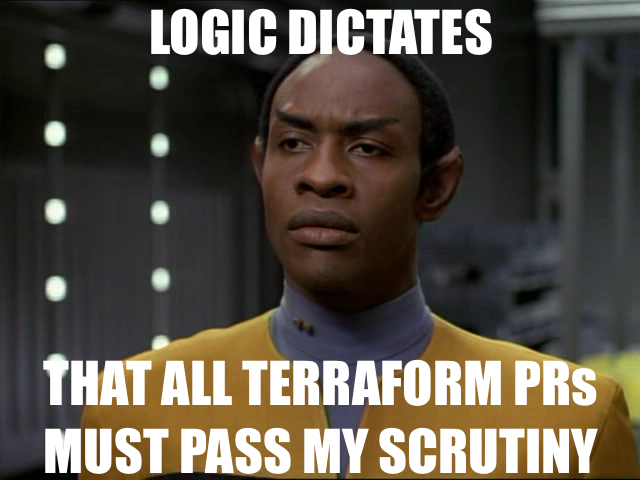

# tuvok: (T)he (U)nnamed (V)alidator, (OK)?

> *[Tuvok](https://en.wikipedia.org/wiki/Tuvok)* `/ˈtuːvɒk/` is a fictional character in the Star Trek media franchise. One of the main characters on the television series Star Trek: Voyager, Tuvok is a member of the fictional Vulcan species who serves as the ship's second officer, Chief of Security, and Chief Tactical Officer. In the Star Trek universe, Vulcans seek to operate by logic and reason, with as little emotion as possible.

Like the Vuclan Tuvok, this project is intended to apply logic and reason to enforce a given set of Terraform standards.
